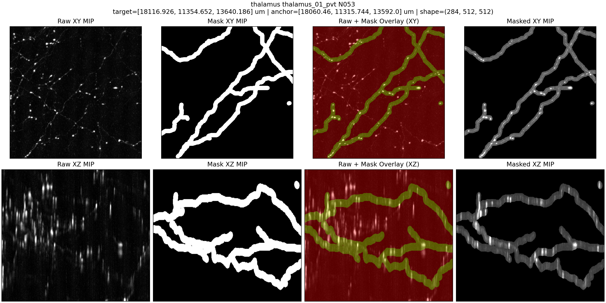
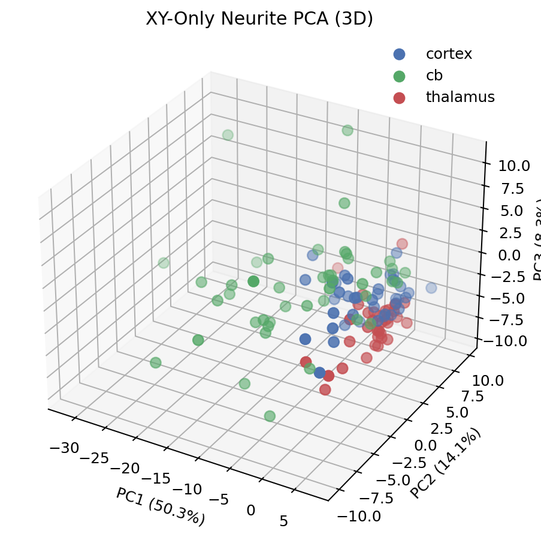
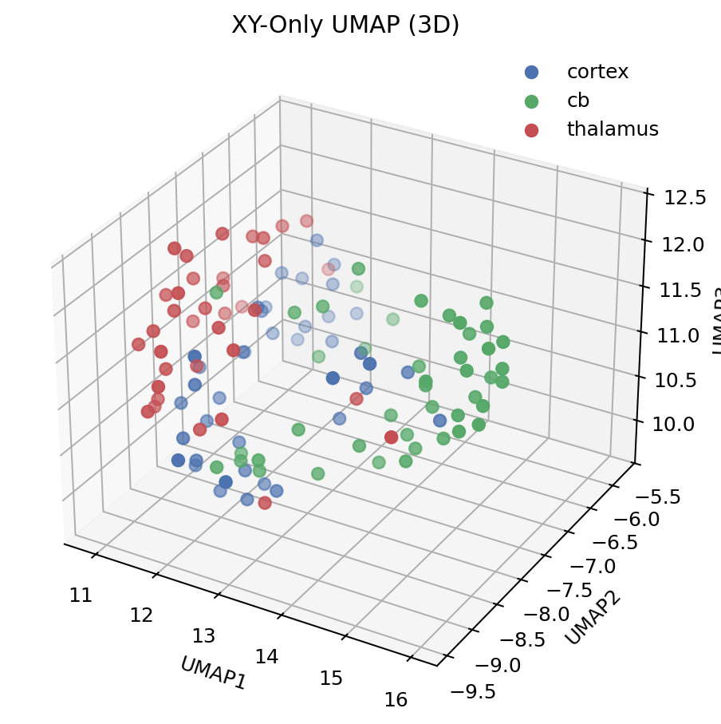

# Whole Brain Reconstruction Visualization Walkthrough

This repo is a clean notebook-first walkthrough for the current `685221` analysis outputs.

It covers:

- the latest sagittal 3D CCF render
- CCF renders with aligned SWC reconstructions inside the atlas
- exact-coordinate level-0 XY MIPs
- automated local carveouts and SWC-derived masks
- XY-only PCA and UMAP
- morphology-only PCA and UMAP

The repo now includes the key rendered figures directly under `assets/`, so the main visual outputs are visible on GitHub and do not depend on external local paths.

## Preview Gallery

### CCF Render With Cells

Latest sagittal CCF render:

CCF with aligned reconstructions overlaid:

### Mask QC

Detailed mask QC example:

### XY-Only Embeddings

3D XY-only PCA:

3D XY-only UMAP:

## Layout

- `assets/`
  Bundled visualization outputs used in the notebook.
- `notebooks/685221_visualization_walkthrough.ipynb`
  Main walkthrough notebook.
- `src/lc_walkthrough/paths.py`
  Small helper module with canonical paths to the bundled assets and to the original workspace scripts.
- `pyproject.toml`
  Minimal project metadata for notebook use.

## Notes

- The notebook reads visual outputs from the repo-local `assets/` directory.
- The notebook still points to the original workspace scripts for the processing entry points, so the implementation references remain accurate.
- The bundled assets include the main figures needed for a GitHub-first walkthrough, while the notebook preserves links to the original processing scripts in the surrounding workspace.
