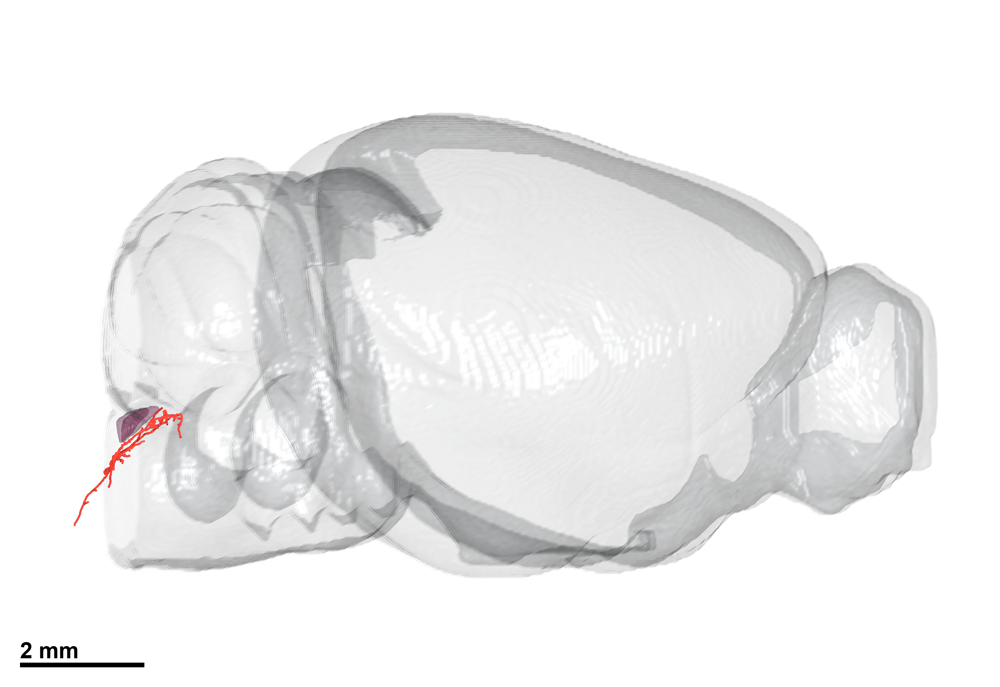
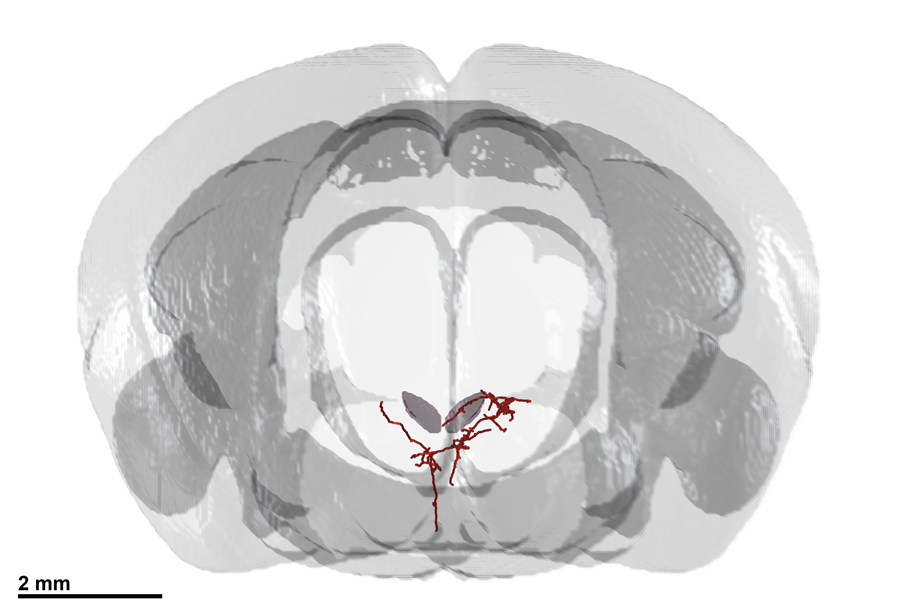
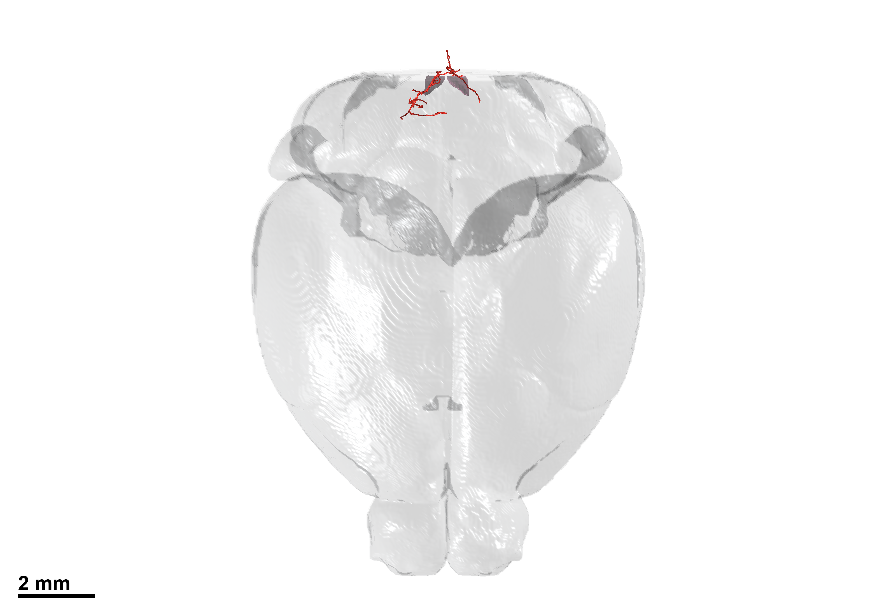
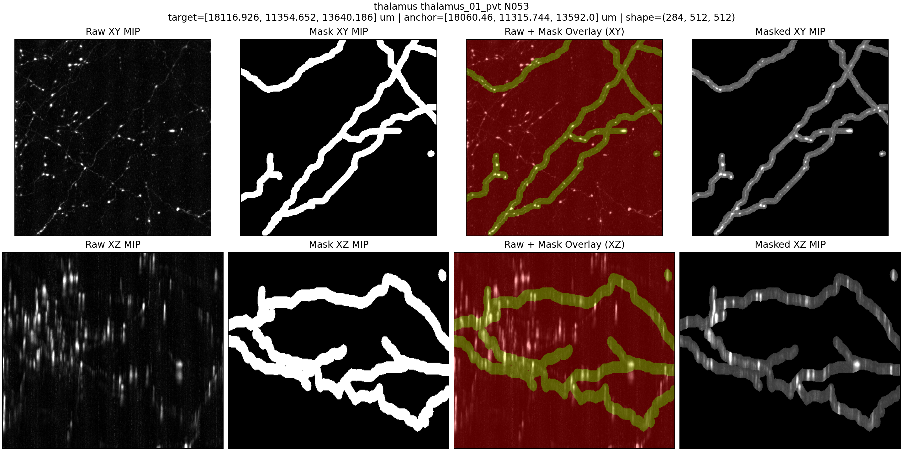
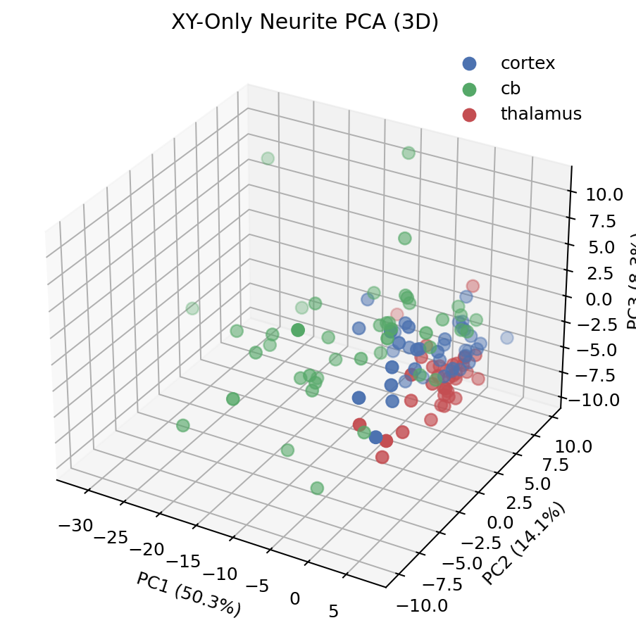
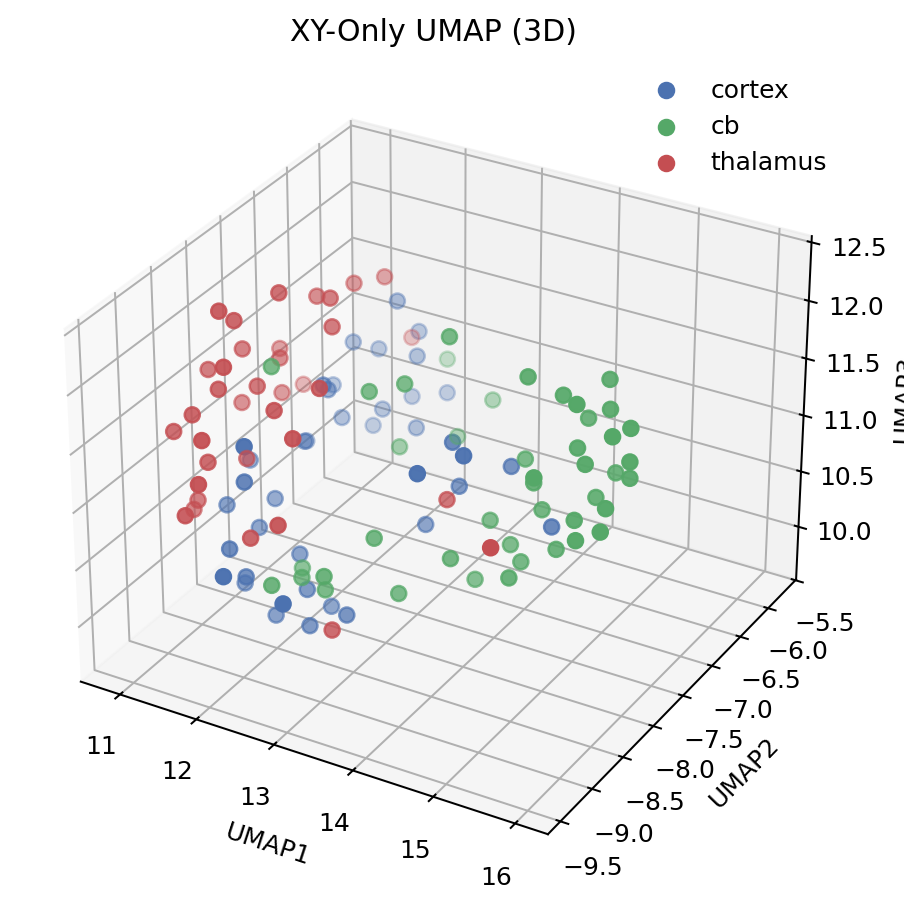

# Whole Brain Reconstruction Visualization Walkthrough

This repo is a clean notebook-first walkthrough for the current `685221` analysis outputs.

It covers:

- sagittal 3D CCF render
- CCF renders with aligned SWC reconstructions inside the atlas
- coronal, sagittal, and horizontal CCF views for aligned SWCs
- Gracile nucleus highlighting in a glass CCF atlas render
- exact-coordinate level-0 XY MIPs of multi-resolution Ome-Zarr imaging data
- automated local image carveouts and SWC-derived masks
- XY-only PCA and UMAP
- morphology-only PCA and UMAP

The repo now includes the key rendered figures directly under `assets/`, so the main visual outputs are visible on GitHub and do not depend on external local paths.

## Quick Start

```bash
python3 -m venv .venv
source .venv/bin/activate
pip install -r requirements.txt
```

Generate the 3D glass CCF views with the example SWC and the Gracile nucleus highlighted in translucent pink:

```bash
python scripts/render_ccf_glass_multiview.py \
  --swc-path examples/swcs/N020-715347-SP.swc \
  --output-dir assets/ccf_glass_gracile \
  --prefix N020-715347-SP
```

Generate flat coronal, sagittal, and horizontal projection panels from the same SWC:

```bash
python scripts/project_swc_ccf_views.py \
  examples/swcs/N020-715347-SP.swc \
  --out-dir assets/ccf_projections \
  --prefix N020-715347-SP
```

The bundled renderer uses:

- `assets/ccf_meshes/annotation_10_nrrd_root_ds4.vtp`: a downsampled full-brain CCF shell for GitHub-friendly reruns.
- `assets/ccf_meshes/gracile_nucleus_1039_25um.vtp`: cached Gracile nucleus mesh from Allen CCF label `1039`.
- `examples/swcs/N020-715347-SP.swc`: example neuron in CCF AP/DV/ML micron coordinates.

For publication-quality local renders, pass a higher-resolution CCF root mesh with `--root-mesh`, for example a locally cached `annotation_10_nrrd_root.vtp`.

## Preview Gallery

### CCF Render With Cells

Latest sagittal CCF render:


CCF with aligned reconstructions overlaid:


### N020-715347-SP With Gracile Nucleus

Sagittal glass CCF render:



Coronal glass CCF render:



Horizontal glass CCF render:



### Mask QC

Detailed mask QC example:



### XY-Only Embeddings

3D XY-only PCA:



3D XY-only UMAP:



## Layout

- `assets/`
  Bundled visualization outputs, example meshes, and generated renders.
- `examples/swcs/`
  Small example SWCs used by the plug-and-play commands.
- `scripts/render_ccf_glass_multiview.py`
  VTK renderer for sagittal, coronal, and horizontal glass CCF views with optional SWC and highlighted CCF region.
- `scripts/project_swc_ccf_views.py`
  Lightweight matplotlib projection panels for CCF-space SWCs.
- `notebooks/685221_visualization_walkthrough.ipynb`
  Main walkthrough notebook.
- `src/lc_walkthrough/paths.py`
  Small helper module with canonical paths to the bundled assets and to the original workspace scripts.
- `src/lc_walkthrough/swc_projection.py`
  Importable implementation used by the projection script.
- `pyproject.toml`
  Project metadata and dependencies.

## Notes

- The notebook reads visual outputs from the repo-local `assets/` directory.
- The notebook still points to the original workspace scripts for the processing entry points, so the implementation references remain accurate.
- The bundled assets include the main figures needed for a GitHub-first walkthrough, while the notebook preserves links to the original processing scripts in the surrounding workspace.
- The flat SWC projection code assumes SWC `x/y/z` are Allen CCF `AP/DV/ML` in microns.
